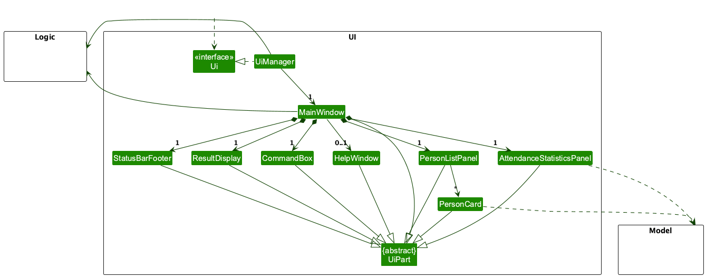
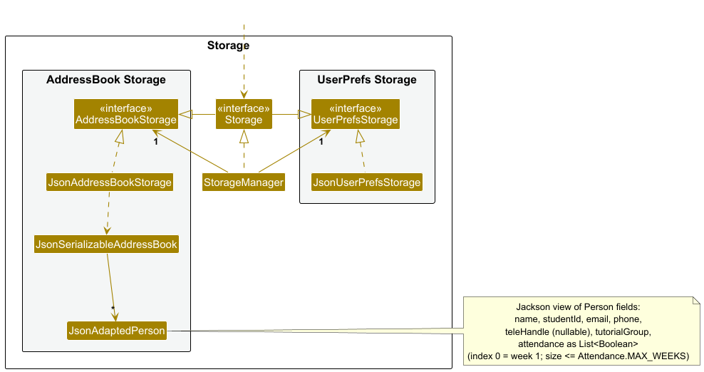

* Table of Contents
{:toc}

--------------------------------------------------------------------------------------------------------------------

## **Acknowledgements**

* This project adapts the architecture and tooling from [se-edu/addressbook-level3](https://github.com/se-edu/addressbook-level3).
* Libraries used: [JavaFX](https://openjfx.io/), [Jackson](https://github.com/FasterXML/jackson), [JUnit 5](https://github.com/junit-team/junit5)

--------------------------------------------------------------------------------------------------------------------

## **Setting up, getting started**

Refer to the guide [_Setting up and getting started_](SettingUp.md).

--------------------------------------------------------------------------------------------------------------------

## **Design**

:bulb: **Tip:** The `.puml` files used to create diagrams are in this document `docs/diagrams` folder. Refer to the [_PlantUML Tutorial_ at se-edu/guides](https://se-education.org/guides/tutorials/plantUml.html) to learn how to create and edit diagrams.

### Architecture

The ***Architecture Diagram*** given above explains the high-level design of the App.

Given below is a quick overview of main components and how they interact with each other.

**Main components of the architecture**

**`Main`** (consisting of classes [`Main`](https://github.com/AY2526S2-CS2103T-T13-2/tp/tree/master/src/main/java/seedu/address/Main.java) and [`MainApp`](https://github.com/AY2526S2-CS2103T-T13-2/tp/tree/master/src/main/java/seedu/address/MainApp.java)) is in charge of the app launch and shut down.
* At app launch, it initializes the other components in the correct sequence, and connects them up with each other.
* At shut down, it shuts down the other components and invokes cleanup methods where necessary.

The bulk of the app's work is done by the following four components:

* [**`UI`**](#ui-component): The UI of the App.
* [**`Logic`**](#logic-component): The command executor.
* [**`Model`**](#model-component): Holds the data of the App in memory.
* [**`Storage`**](#storage-component): Reads data from, and writes data to, the hard disk.

[**`Commons`**](#common-classes) represents a collection of classes used by multiple other components.

**How the architecture components interact with each other**

The *Sequence Diagram* below shows how the components interact with each other for the scenario where the user issues the command `delete 1`.

Each of the four main components (also shown in the diagram above),

* defines its *API* in an `interface` with the same name as the Component.
* implements its functionality using a concrete `{Component Name}Manager` class (which follows the corresponding API `interface` mentioned in the previous point.

For example, the `Logic` component defines its API in the `Logic.java` interface and implements its functionality using the `LogicManager.java` class which follows the `Logic` interface. Other components interact with a given component through its interface rather than the concrete class (reason: to prevent outside component's being coupled to the implementation of a component), as illustrated in the (partial) class diagram below.

The sections below give more details of each component.

### UI component

The **API** of this component is specified in [`Ui.java`](https://github.com/AY2526S2-CS2103T-T13-2/tp/tree/master/src/main/java/seedu/address/ui/Ui.java)

The UI consists of a `MainWindow` that is made up of parts e.g.`CommandBox`, `ResultDisplay`, `PersonListPanel`, `StatusBarFooter` etc. All these, including the `MainWindow`, inherit from the abstract `UiPart` class which captures the commonalities between classes that represent parts of the visible GUI.

The `UI` component uses the JavaFx UI framework. The layout of these UI parts are defined in matching `.fxml` files that are in the `src/main/resources/view` folder. For example, the layout of the [`MainWindow`](https://github.com/AY2526S2-CS2103T-T13-2/tp/tree/master/src/main/java/seedu/address/ui/MainWindow.java) is specified in [`MainWindow.fxml`](https://github.com/AY2526S2-CS2103T-T13-2/tp/tree/master/src/main/resources/view/MainWindow.fxml)

The `UI` component,

* executes user commands using the `Logic` component.
* listens for changes to `Model` data so that the UI can be updated with the modified data.
* keeps a reference to the `Logic` component, because the `UI` relies on the `Logic` to execute commands.
* depends on some classes in the `Model` component, as it displays `Person` object residing in the `Model`.

### Logic component

**API** : [`Logic.java`](https://github.com/AY2526S2-CS2103T-T13-2/tp/tree/master/src/main/java/seedu/address/logic/Logic.java)

Here's a (partial) class diagram of the `Logic` component:

The sequence diagram below illustrates the interactions within the `Logic` component, taking `execute("delete 1")` API call as an example.

:information_source: **Note:** The lifeline for `DeleteCommandParser` should end at the destroy marker (X) but due to a limitation of PlantUML, the lifeline continues till the end of diagram.

How the `Logic` component works:

1. When `Logic` is called upon to execute a command, it is passed to an `AddressBookParser` object which in turn creates a parser that matches the command (e.g., `DeleteCommandParser`) and uses it to parse the command.
1. This results in a `Command` object (more precisely, an object of one of its subclasses e.g., `DeleteCommand`) which is executed by the `LogicManager`.
1. The command can communicate with the `Model` when it is executed (e.g. to delete a person). 
   Note that although this is shown as a single step in the diagram above (for simplicity), in the code it can take several interactions (between the command object and the `Model`) to achieve.
1. The result of the command execution is encapsulated as a `CommandResult` object which is returned back from `Logic`.

Here are the other classes in `Logic` (omitted from the class diagram above) that are used for parsing a user command:

How the parsing works:
* When called upon to parse a user command, the `AddressBookParser` class creates an `XYZCommandParser` (`XYZ` is a placeholder for the specific command name e.g., `AddCommandParser`) which uses the other classes shown above to parse the user command and create a `XYZCommand` object (e.g., `AddCommand`) which the `AddressBookParser` returns back as a `Command` object.
* All `XYZCommandParser` classes (e.g., `AddCommandParser`, `DeleteCommandParser`, ...) inherit from the `Parser` interface so that they can be treated similarly where possible e.g, during testing.

### Model component
**API** : [`Model.java`](https://github.com/AY2526S2-CS2103T-T13-2/tp/tree/master/src/main/java/seedu/address/model/Model.java)

The `Model` component,

* stores the CLI-Tacts data i.e., all `Person` objects (which are contained in a `UniquePersonList` object). Each `Person` corresponds to a CS2040S student and has `Name`, `Phone`, `Email`, `TeleHandle`, `StudentId`, `TutorialGroup`, and `Attendance` (per-week flags).
* stores the currently 'selected' `Person` objects (e.g., results of a search query) as a separate _filtered_ list which is exposed to outsiders as an unmodifiable `ObservableList<Person>` that can be 'observed' e.g. the UI can be bound to this list so that the UI automatically updates when the data in the list change.
* stores a `UserPrefs` object that represents the user’s preferences. This is exposed to the outside as a `ReadOnlyUserPrefs` object.
* does not depend on any of the other three components (as the `Model` represents data entities of the domain, they should make sense on their own without depending on other components)

:information_source: **Note:** AddressBook Level 3 discussed an alternative model with a shared `Tag` list. CLI-Tacts instead uses a single `TutorialGroup` value per `Person`, which simplifies the model for the CS2040S context where each student belongs to one tutorial group at a time.

### Storage component

**API** : [`Storage.java`](https://github.com/AY2526S2-CS2103T-T13-2/tp/tree/master/src/main/java/seedu/address/storage/Storage.java)

The `Storage` component,
* can save both address book data and user preference data in JSON format, and read them back into corresponding objects.
* inherits from both `AddressBookStorage` and `UserPrefsStorage`, which means it can be treated as either one (if only the functionality of only one is needed).
* depends on some classes in the `Model` component (because the `Storage` component's job is to save/retrieve objects that belong to the `Model`)

### Common classes

Classes used by multiple components are in the `seedu.address.commons` package.

--------------------------------------------------------------------------------------------------------------------

## **Implementation**

CLI-Tacts keeps the same overall architecture as AddressBook Level 3 (UI → Logic → Model; Logic → Storage) while using a CS2040S–oriented domain (`Person` with student ID, tutorial group, and per-week attendance).

Feature behaviour (**add**, **delete**, **edit**, **find**, **mark**, **unmark**, **list**, **clear**, etc.) is specified in the [User Guide](UserGuide.md) and summarised under [Appendix: Requirements](#appendix-requirements) (user stories and use cases). **Undo/redo** and **versioned address book history** are not part of this product; each modifying command updates the current `Model` and `Storage` persists to JSON as usual.

--------------------------------------------------------------------------------------------------------------------

## **Documentation, logging, testing, configuration, dev-ops**

* [Documentation guide](Documentation.md)
* [Testing guide](Testing.md)
* [Logging guide](Logging.md)
* [Configuration guide](Configuration.md)
* [DevOps guide](DevOps.md)

--------------------------------------------------------------------------------------------------------------------

## **Appendix: Requirements**

### Product scope

**Target user profile**:

* is a university student Teaching Assistant for CS2040S managing multiple tutorial/lab groups
* needs to track student details and mark or unmark attendance quickly during live classes
* prefers keyboard-only workflows and can type fast
* finds GUI-based portals/spreadsheets too slow for real-time classroom administration
* needs to organize students by tutorial/lab session for quick lookup

**Value proposition**: CLI-Tacts helps CS2040S Teaching Assistants manage student contacts and attendance quickly via CLI by centralising student details and tutorial groupings locally, enabling fast administrative actions (including marking and unmarking attendance) during tutorials without disrupting teaching flow.

### User stories

Priorities: High (must have) - `* * *`, Medium (nice to have) - `* *`, Low (unlikely to have) - `*`

| Priority | As a …​ | I want to …​ | So that I can…​ |
| --- | --- | --- | --- |
| `* * *` | CS2040S Teaching Assistant | add a student with name, student ID, email, phone, tele handle, and tutorial group | set up my tutorial groups at the start of the semester |
| `* * *` | CS2040S Teaching Assistant | edit a student’s contact details | keep records accurate when details change |
| `* * *` | CS2040S Teaching Assistant | delete a student by their index in the displayed list | remove students who drop the module or switch classes |
| `* * *` | CS2040S Teaching Assistant | find students by name (partial match) | locate a student quickly during class |
| `* * *` | CS2040S Teaching Assistant | list all students | get an overview of who is under my care |
| `* * *` | CS2040S Teaching Assistant | filter the student list by tutorial group | focus only on the current class I’m teaching |
| `* * *` | CS2040S Teaching Assistant | mark a student as present for a specific week | track attendance quickly during live tutorials |
| `* * *` | CS2040S Teaching Assistant | mark multiple specific students in one command | record attendance for selected students without repeating single-student marks |
| `* * *` | CS2040S Teaching Assistant | mark every student in a tutorial group for a week in one command | record whole-class attendance without repeating single-student marks |
| `* * *` | CS2040S Teaching Assistant | unmark a student's attendance for a specific week | correct attendance mistakes quickly during live tutorials |
| `* *` | CS2040S Teaching Assistant | view students with low attendance | identify students who may need follow-up |
| `* *` | CS2040S Teaching Assistant | export student and attendance records to a CSV | back up data or submit attendance reports |
| `*` | CS2040S Teaching Assistant | archive or clear a semester’s data | reset the app cleanly for a new semester |

### Use cases

(For all use cases below, the **System** is the `CLI-Tacts` and the **Actor** is the `user`, unless specified otherwise)

**Use case: Delete a student**

**MSS**

1.  User requests to list students
2.  CLI-Tacts shows the student list
3.  User requests to delete a specific student in the list
4.  CLI-Tacts removes the student and saves

    Use case ends.

**Extensions**

* 2a. The list is empty.

  Use case ends.

* 3a. The given index is invalid.

    * 3a1. CLI-Tacts shows an error message.

      Use case resumes at step 2.

**Use case: Add student to tutorial group**

**MSS**

1. User requests to add a student, providing name, student ID, email, phone, tele handle, and tutorial group (e.g. `T01`).
2. CLI-Tacts validates all fields.
3. CLI-Tacts adds the student and saves the data locally.
4. CLI-Tacts displays a success message with the student's details.

      Use case ends.

**Extensions**

1a. Required field missing or invalid (including invalid tutorial group format).
   1a1. CLI-Tacts shows an error message.

   Use case ends.

2a. The student already exists in the address book (duplicate identity).
   2a1. CLI-Tacts shows an error message.

   Use case ends.

**Use case: Mark student attendance**

**MSS**

1. User requests to view students (e.g. `list` or `find`).
2. CLI-Tacts shows the filtered student list with indexes.
3. User requests to mark one or more students using `mark INDEX w/WEEK` or `mark INDEX1 INDEX2 ... w/WEEK`.
4. CLI-Tacts updates the attendance record for the specified student(s).
5. CLI-Tacts confirms the change and refreshes the list display.

      Use case ends.

**Extensions**

* 2a. The list is empty.

  Use case ends.

* 3a. The index is invalid.
    * 3a1. CLI-Tacts shows an error message.

      Use case resumes at step 2.

* 3b. The student is already marked for that week (single-student command).
    * 3b1. CLI-Tacts shows an error message.

      Use case resumes at step 2.

* 3c. User marks multiple students by indices with `mark INDEX1 INDEX2 ... w/WEEK`.
    * 3c1. CLI-Tacts validates all provided indices are within bounds.
    * 3c2. CLI-Tacts updates each student in the list; already-marked students for that week are skipped.
    * 3c3. CLI-Tacts reports counts of updated vs already-recorded students.

      Use case ends.

* 3d. Any index provided in the multiple-index command is invalid.
    * 3d1. CLI-Tacts shows an error message and makes no changes.

      Use case resumes at step 2.

* 3e. User marks an entire tutorial group with `mark t/TUTORIAL_GROUP w/WEEK`.
    * 3e1. CLI-Tacts updates every student in storage with that tutorial group; already-marked students for that week are skipped.
    * 3e2. CLI-Tacts reports counts of updated vs already-recorded students.

      Use case ends.

* 3f. No student has the given tutorial group (group mark).
    * 3f1. CLI-Tacts shows an error message.

      Use case ends.

**Use case: Unmark student attendance**

**MSS**

1. User requests to list students in a specific tutorial group.
2. CLI-Tacts shows the list of students for that group.
3. User requests to unmark a specific student by index and the specific week.
4. CLI-Tacts updates the attendance record for that student.
5. CLI-Tacts confirms the attendance status change.

   Use case ends.

**Extensions**

1a. The specified tutorial group does not exist.
   1a1. CLI-Tacts shows an error message.

   Use case ends.

3a. The user provides an invalid index or week.
   3a1. CLI-Tacts shows an error message.

   Use case resumes at step 2.

3b. User wants to unmark the entire group (bulk action).
   3b1. User enters a bulk command (e.g., `unmark t/T01 w/2`).
   3b2. CLI-Tacts updates every student in storage with that tutorial group who was marked for that week; already-unmarked students are skipped.

   Use case ends.

**Use case: Search up student to view attendance record**
**MSS**

1. User requests to find students by name keywords and/or tutorial group (e.g. `find`).
2. CLI-Tacts updates the visible list to matching students.
3. CLI-Tacts displays the student's profile, including a summary of their attendance (eg., "Present: 5/6 weeks").
4. CLI-Tacts provides a visual breakdown of which specific weeks were attended.

   Use case ends.

**Extensions**

2a. No student matches the search criteria.
   2a1. CLI-Tacts displays a "No results found" message.

   Use case ends.

2b. Multiple students share the same name.
   2b1. CLI-Tacts lists all matching students with their tutorial group IDs.
   2b2. User selects the correct student by index.

   Use case resumes at step 3.

### Non-Functional Requirements

**Performance**
1.  All commands (`add`, `delete`, `edit`, `find`, `list`, `clear`, `mark`, `unmark`, `export`) should return a response within 1 second when the dataset contains up to 200 students.
2.  The application should launch and load stored data within 2 seconds for datasets up to 200 students.

---

**Usability**
1.  The system must be fully operable using keyboard-only commands without requiring mouse interaction.
2.  All commands must follow a consistent prefix format (e.g., `n/`, `i/`, `e/`, `t/`) to ensure predictable command usage.
3.  A user with above average typing speed for regular English text (i.e. not code, not system admin commands) should be able to accomplish most of the tasks faster using commands than using the mouse.
4.  When a command fails, the system must provide clear and informative error messages explaining the issue and the correct command format.

---

**Reliability**

1.  All modifications to student data (`add`, `delete`, `edit`, `mark`, `unmark`, `clear`) must be automatically saved immediately after execution.
2.  On application startup, the system must automatically load previously saved data if the storage file exists and is valid.
3.  If the address book file cannot be loaded (for example, corrupted JSON), the system must recover without crashing (the current implementation starts from an empty address book and logs a warning).
4.  After a modifying command completes successfully, changes are persisted; a crash mid-command may leave that command’s effects unsaved.
5.  The system should gracefully handle invalid input commands without crashing.

---

**Scalability**
1. The system must support at least 200 students across multiple tutorial groups still meeting the defined performance requirements.
2. The system should maintain command response times within 1 second as the number of stored students increases up to the supported limit.
3. The system should allow new tutorial groups to be added without requiring changes to the system configuration or code.
4. The system should allow the dataset to grow across multiple tutorial groups without affecting the accuracy of search or attendance operations.
5. The storage format should support efficient reading and writing even as the number of stored student records increases.
6. The system should be able to load and display large student lists without causing the interface to freeze or become unresponsive.
7. The system architecture should allow future expansion to support additional student attributes without significant redesign of the storage structure.

---

**Compatibility**
1.  The application should run on any mainstream OS.
2.  The application should run on systems with Java 17 or above installed.

---

**Storage**
1.  All student data must be stored locally on the user's machine in a structured format such as **JSON**.

---

**System Constraints**
1.  The system is designed for single-user operation only and does not support concurrent multi-user access.
2.  The application should function fully without requiring an internet connection.

---

**Security**
1.  Student data should remain stored locally and not be transmitted externally.
2.  The application must not transmit any student data to external servers.

---

**Quality**
1. The system should be usable by a teaching assistant who has no prior experience with command line applications after reading the user guide once.
2. A new user should be able to successfully add a student and mark or unmark attendance within 5 minutes of first launching the application.
3. After the relevant list is shown, common actions such as marking or unmarking a student by index should be doable in one command.

### Glossary

* Application data directory: The folder on the user’s computer where CLI-Tacts stores its data file and preferences.

* Command: A text instruction typed by the user into the command box to perform an action (e.g., add, delete, find, mark, unmark).

* Command prefix: A token that identifies the value of a field in a command (e.g., n/ for name, i/ for student id, e/ for email, t/ for tutorial group).

* Command result: The message returned by the system after executing a command, indicating success or failure.

* Core features: The main functions needed for typical use in tutorials, including add, delete, edit, find, list, mark, unmark, clear, export, loading, and saving.

* Dataset: The complete set of student records stored by the application at a given time.

* Duplicate student id: A student id that matches an existing student id already stored in the application.

* Error message: A message displayed to inform the user that a command failed and to explain the reason for the failure.

* Filtered list: A temporary view of the student list that shows only students matching certain criteria (e.g., search results or a tutorial group filter).

* Frozen or unresponsive: A state where the user interface does not update and does not accept new input for more than 1 second.

* Invalid command format: A command that does not match the required structure or is missing required prefixes or parameters.

* Java runtime: The software environment required to run the application, specifically Java version 17 or above.

* Mainstream OS: Windows, macOS, or Linux operating systems.

* Modifying command: Any command that changes stored data (e.g., add, delete, mark, unmark, clear).

* Offline: The application can be used without an internet connection and without relying on any online services.

* Performance requirements: The response time and startup time targets defined in the non-functional requirements.

* Response time: The time between when a user enters a command and when the application displays the resulting output and updates the interface.

* Single-user operation: A usage model where the application is intended to be used by one user on one machine without concurrent access from multiple users.

* Storage file: The local file used to store student records so that data persists between application sessions.

* Structured format: A machine-readable data format with defined fields and structure, such as JSON.

* Student record: A stored entry representing one student's details and attendance information.

* Student id: The unique identifier for a student (e.g., A0123456X) used as the primary key for identifying a student in the application.

* Tutorial group: A label used to group students by tutorial or lab session (e.g., T12) for filtering and attendance marking/unmarking.

* Typical usage: Normal operation during a semester for a teaching assistant managing up to 200 students across multiple tutorial groups.

* User guide: The documentation that explains how to use the application's commands and features.

* Validation: The process of checking user input to ensure it matches the required format before executing a command.

--------------------------------------------------------------------------------------------------------------------

## **Appendix: Instructions for manual testing**

Given below are instructions to test the app manually.

:information_source: **Note:** These instructions only provide a starting point for testers to work on;
testers are expected to do more *exploratory* testing.

### Launch and shutdown

1. Initial launch

   1. Download the jar file and copy into an empty folder

   1. Double-click the jar file Expected: Shows the GUI with a set of sample contacts. The window size may not be optimum.

1. Saving window preferences

   1. Resize the window to an optimum size. Move the window to a different location. Close the window.

   1. Re-launch the app by double-clicking the jar file. 
       Expected: The most recent window size and location is retained.

1. _{ more test cases …​ }_

### Deleting a person

1. Deleting a person while all persons are being shown

   1. Prerequisites: List all persons using the `list` command. Multiple persons in the list.

   1. Test case: `delete 1` 
      Expected: First contact is deleted from the list. Details of the deleted contact shown in the status message. Timestamp in the status bar is updated.

   1. Test case: `delete 0` 
      Expected: No person is deleted. Error details shown in the status message. Status bar remains the same.

   1. Other incorrect delete commands to try: `delete`, `delete x`, `...` (where x is larger than the list size) 
      Expected: Similar to previous.

1. _{ more test cases …​ }_

### Saving data

1. Dealing with missing/corrupted data files

   1. _{explain how to simulate a missing/corrupted file, and the expected behavior}_

1. _{ more test cases …​ }_
