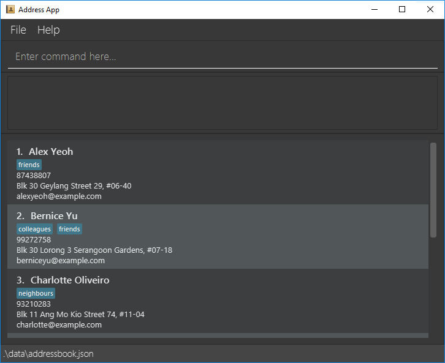
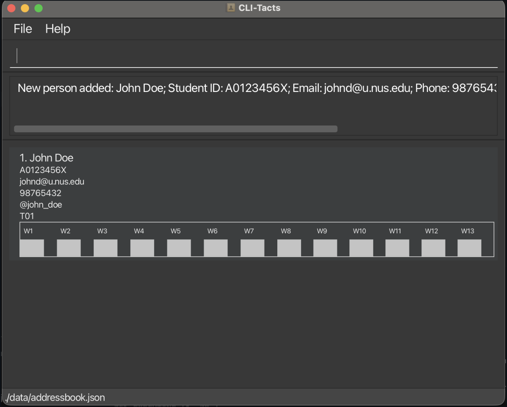
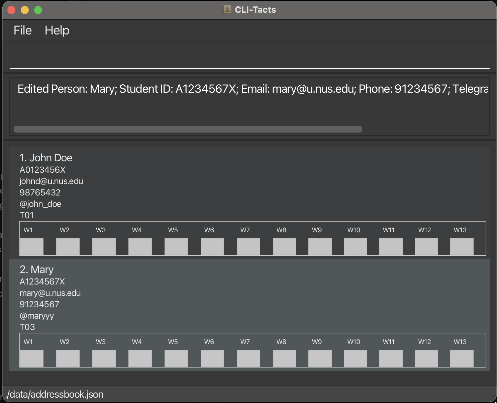
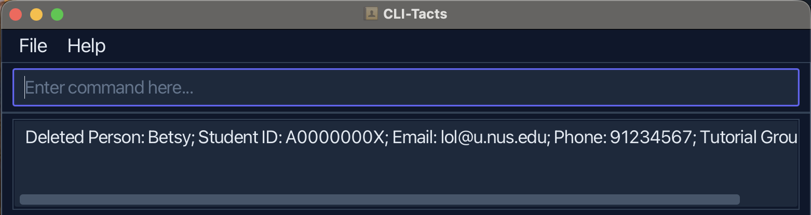

CLI-Tacts is a lightweight application to manage your CS2040S students! It is optimised for **Command Line Interface 
usage (CLI)**, while having the benefits of a **Graphical User Interface (GUI)**. The best of both worlds, quickness of a CLI and visualisation of a GUI! For fast typers, CLI-Tacts helps you optimise your workflow better than traditional GUI-only grading portals.

The primary users are **CS2040S Teaching Assistants** who:
* manage multiple tutorial or lab groups concurrently
* need to **take attendance quickly** and look up student details on the spot
* prefer keyboard-driven workflows during lab sessions


* Table of Contents
{:toc}

--------------------------------------------------------------------------------------------------------------------

## Quick start

1. Ensure you have Java `17` or above installed in your Computer.<br>
   **Mac users:** Ensure you have the precise JDK version prescribed [here](https://se-education.org/guides/tutorials/javaInstallationMac.html).

1. Download the latest CLI-Tacts `.jar` file:
   * Go to the [GitHub releases page](https://github.com/AY2526S2-CS2103T-T13-2/tp/releases).
   * Under the latest release, download the `.jar` file.

1. Copy the file to the folder you want to use as the _home folder_ for CLI-Tacts.

1. Open a command terminal, `cd` into the folder you put the jar file in, and use the `java -jar CLI-Tacts.jar` command to run the application.<br>
   A GUI similar to the below should appear in a few seconds. If this is your first time using CLI-Tacts (or no existing data file is found), the app starts with sample data so you can try commands immediately.<br>
   

1. Type the command in the command box and press Enter to execute it. e.g. typing `help` and pressing Enter will open the help window containing the link to this user guide.<br>
   Some example commands you can try:

   * `list` : Lists all students.

   * `add n\John Doe i\A0123456X e\johnd@u.nus.edu p\98765432 th\@johndoe t\T01` : Adds student `John Doe` to CLI-Tacts.

   * `mark 1 w\1` : Marks the first student's attendance for week 1.

   * `delete 3` : Deletes the 3rd student shown in the current list.

   * `clear` : Deletes all students.

   * `exit` : Exits the app.

1. Refer to the [Features](#features) below for details of each command.

--------------------------------------------------------------------------------------------------------------------

## Features

<div markdown="block" class="alert alert-info">

**:information_source: Notes about the command format:**<br>

* Words in `UPPER_CASE` are the parameters to be supplied by the user.<br>
  e.g. in `add n\NAME`, `NAME` is a parameter which can be used as `add n\John Doe`.

* Items in square brackets are optional.<br>
  e.g `n\NAME [th\TELE_HANDLE]` can be used as `n\John Doe th\@johndoe` or as `n\John Doe`.

* Items with `…`​ after them can be used multiple times including zero times.<br>
  Currently, CLI-Tacts uses a **single tutorial group** per student, so you will not see repeated `t\` prefixes.

* Parameters can be in any order for `add`, `edit` , `mark`, `unmark` and `find` commands.<br>
  e.g. if the command specifies `n\NAME p\PHONE_NUMBER`, `p\PHONE_NUMBER n\NAME` is also acceptable.

* `edit` and `delete` require `INDEX`; `mark` and `unmark` can be done by `INDEX` or by `TUTORIAL_GROUP`.

* Extraneous parameters for commands that do not take in parameters (such as `help`, `list`, `exit`, `export` and `clear`) will be ignored.<br>
  e.g. if the command specifies `help 123`, it will be interpreted as `help`.

* If you are using a PDF version of this document, be careful when copying and pasting commands that span multiple lines as space characters surrounding line-breaks may be omitted when copied over to the application.
</div>

### Viewing help : `help`

Shows a message explaining how to access the help page.


Format: `help`

### Adding a student: `add`

#### Overview
Adds a student to CLI-Tacts. Telegram handle is optional (useful for contacting students quickly, but not required).

#### Format
```
add n\NAME i\STUDENT_ID e\EMAIL p\PHONE_NUMBER [th\TELE_HANDLE] t\TUTORIAL_GROUP
```

#### Parameters

* **NAME**: Should only contain alphanumeric characters, spaces, hyphens (`-`), commas (`,`), apostrophes (`'`), and forward slashes (`/`). The first character must be alphanumeric. Max 54 characters.
* **STUDENT_ID**: Must start with `A` (case-insensitive), followed by 7 digits and 1 letter (e.g. `A0123456X`). Stored in uppercase.
* **EMAIL**: Must follow NUS email format with constraints:
  * Must be of the format `local-part@u.nus.edu` (domain is strictly `u.nus.edu`)
  * The local-part should only contain alphanumeric characters and special characters: `+`, `_`, `.`, `-`
  * Each special character must be surrounded by alphanumeric characters (no consecutive special characters, cannot start or end with a special character)
  * The local-part must be at most 50 characters long
  * Valid examples: `john.doe@u.nus.edu`, `alice+sem1@u.nus.edu`
  * Invalid examples: `john..doe@u.nus.edu`, `.john@u.nus.edu`, `alice@gmail.com`
* **PHONE_NUMBER**: Digits only, **3 to 15 digits** inclusive (e.g. `98765432`, `123`).
* **TELE_HANDLE** (optional): Must start with `@`, 5–32 characters (letters, numbers, underscores). Case-insensitive, stored in lowercase.
* **TUTORIAL_GROUP**: **3 to 5 alphanumeric characters** (letters or digits only). Letter casing is ignored on input; the value is **stored in uppercase** (e.g. `t01` and `T01` both become `T01`).
  * Valid: `T01`, `t01`, `CS204` ✓
  * Invalid: `ab` (too short), `T01234` (too long), `T-01` ✗

#### Examples

* `add n\Amy Bee i\A0123456X e\amy@u.nus.edu p\11111111 th\@amy_bee t\T01`
* `add n\Bob Chan i\A0765432Y e\bobchan@u.nus.edu p\99998888 th\@bobchan t\T02`



{: #add-possible-error-messages}
#### Possible Error Messages

<div style="border: 1px solid #bfbfbf; border-radius: 8px; padding: 10px 12px; margin: 8px 0 12px 0;">

**Missing required fields** — If any non-optional field (`n\`, `i\`, `e\`, `p\`, `t\`) is missing:
<div style="border: 1px solid #d9d9d9; border-radius: 6px; padding: 8px 12px; margin: 8px 0;">
<code>Invalid command format!<br>
add: Adds a student to the address book. Parameters: n\NAME i\STUDENT_ID e\EMAIL p\PHONE [th\TELE_HANDLE] t\TUTORIAL_GROUP<br>
Example: add n\John Doe i\A0123456X e\johnd@u.nus.edu p\98765432 th\@john_doe t\T01</code>
</div>

**Duplicate field prefix** — If multiple values are specified for a single-valued field (e.g., `n\John n\Doe`):
<div style="border: 1px solid #d9d9d9; border-radius: 6px; padding: 8px 12px; margin: 8px 0;">
<code>Multiple values specified for the following single-valued field(s): n\</code>
</div>

**Invalid name** — If an invalid name is supplied:
<div style="border: 1px solid #d9d9d9; border-radius: 6px; padding: 8px 12px; margin: 8px 0;">
<code>Names should only contain alphanumeric characters, spaces, hyphens, commas, apostrophes, and forward slashes. The first character must be alphanumeric.</code>
</div>

**Invalid email** — If an invalid email is supplied:
<div style="border: 1px solid #d9d9d9; border-radius: 6px; padding: 8px 12px; margin: 8px 0;">
<code>Emails should be of the format local-part@u.nus.edu and adhere to the following constraints:<br>
1. The local-part should only contain alphanumeric characters and these special characters, excluding the parentheses, (+_.-).<br>
2. Each special character must be surrounded by alphanumeric characters (i.e. the local-part cannot start or end with a special character, and cannot contain consecutive special characters).<br>
3. The local-part must be at most 50 characters long.<br>
4. The domain must be exactly u.nus.edu.</code>
</div>

**Invalid student ID** — If an invalid student ID is supplied:
<div style="border: 1px solid #d9d9d9; border-radius: 6px; padding: 8px 12px; margin: 8px 0;">
<code>Invalid Student ID! Use 'A', 7 digits, and one letter (e.g. A0123456X). Letters are case-insensitive; stored in uppercase.</code>
</div>

**Invalid phone number** — If an invalid phone number is supplied:
<div style="border: 1px solid #d9d9d9; border-radius: 6px; padding: 8px 12px; margin: 8px 0;">
<code>Phone numbers should only contain digits, and be between 3 and 15 digits long (inclusive).</code>
</div>

Note: As of **2026**, the shortest allowed length is **3** digits and the longest is **15** digits.

**Invalid Telegram handle** — If an invalid Telegram handle is supplied:
<div style="border: 1px solid #d9d9d9; border-radius: 6px; padding: 8px 12px; margin: 8px 0;">
<code>Telegram handle should start with '@' followed by 5 to 32 characters (letters, numbers, underscores).</code>
</div>

**Invalid tutorial group** — If an invalid tutorial group is supplied:
<div style="border: 1px solid #d9d9d9; border-radius: 6px; padding: 8px 12px; margin: 8px 0;">
<code>Tutorial group should be 3 to 5 alphanumeric characters (letters or digits) inclusive. Letters are case-insensitive; stored in uppercase.</code>
</div>

**Duplicate student ID** — If a student with the same student ID already exists:
<div style="border: 1px solid #d9d9d9; border-radius: 6px; padding: 8px 12px; margin: 8px 0;">
<code>This ID already exists in the address book</code>
</div>

**Duplicate email** — If a student with the same email already exists:
<div style="border: 1px solid #d9d9d9; border-radius: 6px; padding: 8px 12px; margin: 8px 0;">
<code>This email is already used by another student.</code>
</div>

**Duplicate phone number** — If a student with the same phone number already exists:
<div style="border: 1px solid #d9d9d9; border-radius: 6px; padding: 8px 12px; margin: 8px 0;">
<code>This phone number is already used by another student.</code>
</div>

**Duplicate Telegram handle** — If a student with the same Telegram handle already exists:
<div style="border: 1px solid #d9d9d9; border-radius: 6px; padding: 8px 12px; margin: 8px 0;">
<code>This Telegram handle is already used by another student.</code>
</div>

</div>

### Editing a student : `edit`

#### Overview
Edits an existing student in CLI-Tacts. Field values can be updated while keeping others unchanged.

#### Format
```
edit INDEX [n\NAME] [i\STUDENT_ID] [e\EMAIL] [p\PHONE] [th\TELE_HANDLE] [t\TUTORIAL_GROUP]
```

#### Parameters

- **INDEX**: The index refers to the index number shown in the displayed student list. **Must be a positive integer** (1, 2, 3, …).
- **NAME, STUDENT_ID, EMAIL, PHONE, TELE_HANDLE, TUTORIAL_GROUP**: Optional; use the same format and constraints as in the [`add` command's possible error](#adding-a-student-add). At least one field must be provided.
- **Behavior**: Existing values will be updated to the input values. Omitted fields remain unchanged.

#### Examples

* `edit 2 p\99272758 e\berniceyu@u.nus.edu` — Edits the phone number and email address of the 2nd student.
* `edit 2 t\T03` — Moves the 2nd student to tutorial group T03.



{: #edit-possible-error-messages}
#### Possible Error Messages

<div style="border: 1px solid #bfbfbf; border-radius: 8px; padding: 10px 12px; margin: 8px 0 12px 0;">

**Missing or invalid index**:
<div style="border: 1px solid #d9d9d9; border-radius: 6px; padding: 8px 12px; margin: 8px 0;">
<code>Invalid command format!<br>
edit: Edits the details of the student identified by the index number used in the displayed student list. Existing values will be overwritten by the input values.<br>
Parameters: INDEX (must be a positive integer) [n\NAME] [i\STUDENT_ID] [e\EMAIL] [p\PHONE] [th\TELE_HANDLE] [t\TUTORIAL_GROUP]<br>
Example: edit 1 n\John Doe i\A0123456X e\johndoe@u.nus.edu p\91234567 th\@john_doe</code>
</div>

**No fields provided**:
<div style="border: 1px solid #d9d9d9; border-radius: 6px; padding: 8px 12px; margin: 8px 0;">
<code>At least one field to edit must be provided.</code>
</div>

**Duplicate student ID** — If the new student ID is already used by another student:
<div style="border: 1px solid #d9d9d9; border-radius: 6px; padding: 8px 12px; margin: 8px 0;">
<code>This student ID is already used by another student.</code>
</div>

**Duplicate email** — If the new email is already used by another student:
<div style="border: 1px solid #d9d9d9; border-radius: 6px; padding: 8px 12px; margin: 8px 0;">
<code>This email is already used by another student.</code>
</div>

**Duplicate phone number** — If the new phone number is already used by another student:
<div style="border: 1px solid #d9d9d9; border-radius: 6px; padding: 8px 12px; margin: 8px 0;">
<code>This phone number is already used by another student.</code>
</div>

**Invalid field value** — If any field value is invalid, refer to the [`add` command section](#add-possible-error-messages) for the specific constraint message.

**Duplicate field prefix** — If multiple values are specified for a single-valued field (e.g., `n\John n\Doe`), refer to the corresponding error message in the [`add` command section](#add-possible-error-messages).

</div>

### Locating students by name, tutorial group, email, or telegram handle: `find`

Allows a TA to **filter the student list** to find specific individuals based on their name, tutorial group, NUS email, or Telegram handle. This is useful when the matric number (student ID) is not immediately known. The filtered results are displayed in **insertion order** (the order students were added to the application).

#### Formats

* `find n\NAME`
* `find t\TUTORIAL_GROUP`
* `find e\EMAIL`
* `find th\TELE_HANDLE`
* `find n\john t\T01 e\alice@u.nus.edu th\@alice_bot` (combine any prefixes)

At least one of `n\`, `t\`, `e\`, or `th\` must be present.

#### Parameters

##### Name filter (`n\`)

* **How it works**: Each `n\` field is treated as a separate search term. A student matches if their name contains any of the search terms (OR logic between multiple `n\` fields).
  — Each search term is matched as a **prefix** of any word in the student's full name (case-insensitive).
  — Words are case-insensitive.
* **Multiple `n\` fields**: Using multiple `n\` fields lets you search for different names with OR logic.
  — Example: `find n\john n\ann` matches students whose name contains **"john" OR "ann"** (as word prefixes).
* **Examples**:
  — For a student named "John Doe":
    * `find n\john` matches ✓ (the word "John" starts with "john")
    * `find n\doe` matches ✓ (the word "Doe" starts with "doe")
    * `find n\john doe` matches ✓ (words start with "john" and "doe")
    * `find n\joh do` matches ✗ (no single word starts with the phrase "joh do")
    * `find n\jane` does not match ✗ (no word starts with "jane")

Example after applying `find n\Ale`:


##### Tutorial group filter (`t\`)

* **Input restrictions**: Same format as `TUTORIAL_GROUP` in `add` / `edit` (3–5 alphanumeric characters).
* **Case-insensitive**: Values are **stored in uppercase**; you may type any letter casing and filtering still matches.

Example after applying `find t\T02`:


##### Email filter (`e\`)

* **Prefix matching**: The value after `e\` is treated as a prefix match on email (case-insensitive).
  — Example: `find e\Cha` can match `charlotte@u.nus.edu`.

Example after applying `find e\Cha`:


##### Telegram handle filter (`th\`)

* **Prefix matching**: The value after `th\` is treated as a prefix match on Telegram handle (case-insensitive).

Example after applying `find th\@ro`:


##### Combined filters

* You can combine multiple filter types in one command to narrow results further.
  — Example: `find n\john t\T01` finds students named "john" who are also in tutorial group "T01".

{: #find-possible-error-messages}
#### Possible Error Messages

<div style="border: 1px solid #bfbfbf; border-radius: 8px; padding: 10px 12px; margin: 8px 0 12px 0;">

**Invalid tutorial group format**:
<div style="border: 1px solid #d9d9d9; border-radius: 6px; padding: 8px 12px; margin: 8px 0;">
<code>Tutorial group should be 3 to 5 alphanumeric characters (letters or digits) inclusive. Letters are case-insensitive; stored in uppercase.</code>
</div>

</div>

### Listing all students : `list`

#### Overview
Shows all students in CLI-Tacts in the order they were added. The display includes all student details and updates the attendance statistics panel.

#### Format
```
list
```

#### Display Details
* Shows all students in the address book with their index numbers, names, student IDs, emails, phone numbers, Telegram handles (if present), and tutorial groups.
* Students are displayed in **insertion order** (the order they were added to the application), not alphabetically.
* The attendance statistics panel at the bottom updates to show statistics for all students.

#### Examples
* `list` — displays all students.

### Deleting a student : `delete`

#### Overview
Deletes the specified student from CLI-Tacts.

#### Format
```
delete INDEX
```

#### Parameters

- **INDEX**: The position in the **currently displayed** student list. **Must be a positive integer** (1, 2, 3, …).

#### Examples

* `list` followed by `delete 2` — Deletes the 2nd student in the address book.
* `find n\Betsy` followed by `delete 1` — Deletes the 1st student in the results of the `find` command.



{: #delete-possible-error-messages}
#### Possible Error Messages

<div style="border: 1px solid #bfbfbf; border-radius: 8px; padding: 10px 12px; margin: 8px 0 12px 0;">

**Invalid command format** — If index is missing or in invalid format:
<div style="border: 1px solid #d9d9d9; border-radius: 6px; padding: 8px 12px; margin: 8px 0;">
<code>Invalid command format!<br>
delete: Deletes the student identified by the index number used in the displayed student list.<br>
Parameters: INDEX (must be a positive integer)<br>
Example: delete 1</code>
</div>

**Index out of bounds** — If the index is outside the valid range:
<div style="border: 1px solid #d9d9d9; border-radius: 6px; padding: 8px 12px; margin: 8px 0;">
<code>This student's index provided is invalid.</code>
</div>
</div>

### Marking attendance : `mark`

CLI-Tacts supports **three ways to mark attendance** for a given week (positive integer, typically 1–13).

#### Formats

* `mark INDEX w\WEEK`
* `mark INDEX1 INDEX2 ... w\WEEK`
* `mark t\TUTORIAL_GROUP w\WEEK`

#### Parameters

* **INDEX** — Position in the **currently displayed** student list (`list`, `find`, etc.). Must be a positive integer.
* **INDEX1 INDEX2 ...** — Two or more **space-separated** indices from the **currently displayed** student list.
* **TUTORIAL_GROUP** — 3–5 alphanumeric characters (e.g., `T01`, `Lab2`). Letter casing is ignored; values match the **uppercase** form stored for each student.
* **WEEK** — The week number to mark attendance for. Must be a positive integer between 1–13.

#### Examples

* **Single student** (by index):
  * `mark 1 w\ 2` — marks the 1st student in the displayed list for week 2.
  * `find n\ John` followed by `mark 1 w\ 1` — among students named "John" in the filtered list, marks the 1st for week 1.
  * `find t\ T01` followed by `mark 3 w\ 4` — in the T01-only list, marks the 3rd student for week 4.

* **Multiple students** (by indices):
  * `mark 1 2 3 w\ 5` — marks students at positions 1, 2, and 3 in the displayed list for week 5.
  * `find t\ T01` followed by `mark 1 2 w\ 3` — in the T01-filtered list, marks the 1st and 2nd students for week 3.
  * Students **already** marked for that week are **skipped** (no error). Duplicate indices are counted only once.

* **Tutorial group** (all students):
  * `mark t\ T02 w\ 2` — marks all students in tutorial group `T02` for week 2.
  * `mark w\ 2 t\ T02` — same as above, with prefix order reversed.
  * Applies to **every student stored** with that tutorial group, **not** only those visible after a `find`.
  * Students **already** marked for that week are **skipped** (no error).

{: #mark-possible-error-messages}
#### Possible Error Messages

<div style="border: 1px solid #bfbfbf; border-radius: 8px; padding: 10px 12px; margin: 8px 0 12px 0;">

**Invalid command format:**
<div style="border: 1px solid #d9d9d9; border-radius: 6px; padding: 8px 12px; margin: 8px 0;">
<code>Invalid command format!<br>
mark: Marks attendance for one or more students by list index, or for everyone in a tutorial group.<br>
Parameters (single): INDEX (positive integer) w\ WEEK (positive integer)<br>
Parameters (multiple): INDEX1 INDEX2 ... (positive integers) w\ WEEK (positive integer)<br>
Parameters (group): t\ TUTORIAL_GROUP w\ WEEK (positive integer)<br>
Example (single): mark 1 w\ 2<br>
Example (multiple): mark 1 2 3 w\ 2<br>
Example (group): mark t\ T02 w\ 2</code>
</div>

**Invalid index:**
<div style="border: 1px solid #d9d9d9; border-radius: 6px; padding: 8px 12px; margin: 8px 0;">
<code>This student's index provided is invalid.</code>
</div>

**Student already marked:**
<div style="border: 1px solid #d9d9d9; border-radius: 6px; padding: 8px 12px; margin: 8px 0;">
<code>X has already been marked as attended for week Y.</code>
</div>

**Invalid week number:**
<div style="border: 1px solid #d9d9d9; border-radius: 6px; padding: 8px 12px; margin: 8px 0;">
<code>Week must be a positive integer between 1 to 13.</code>
</div>

**No students in tutorial group:**
<div style="border: 1px solid #d9d9d9; border-radius: 6px; padding: 8px 12px; margin: 8px 0;">
<code>No students found in tutorial group X.</code>
</div>

**Duplicate field prefix** — If multiple values are specified for a single-valued field (e.g., `w\ 1 w\ 2`), refer to the corresponding error message in the [`add` command section](#add-possible-error-messages).

</div>

### Unmarking attendance : `unmark`

CLI-Tacts supports **two ways to unmark attendance** for a given week (positive integer, typically 1–13).

#### Formats

* `unmark INDEX w\WEEK`
* `unmark t\TUTORIAL_GROUP w\WEEK`

#### Parameters

* **INDEX** — Position in the **currently displayed** student list (`list`, `find`, etc.). Must be a positive integer.
* **TUTORIAL_GROUP** — 3–5 alphanumeric characters (e.g., `T01`, `Lab2`). Letter casing is ignored; values match the **uppercase** form stored for each student.
* **WEEK** — The week number to unmark attendance for. Must be a positive integer between 1–13.

#### Examples

* **Single student** (by index):
  * `unmark 1 w\2` — unmarks the 1st student in the displayed list for week 2.
  * `unmark w\2 1` — same as above, with prefix order reversed.

* **Tutorial group** (all students):
  * `unmark t\T01 w\4` — unmarks attendance for all marked students in tutorial group T01 for week 4.
  * `unmark w\4 t\T01` — same as above, with prefix order reversed.
  * Applies to **every student stored** with that tutorial group, **not** only those visible after a `find`.
  * Students not marked for that week are **skipped** (no error).

{: #unmark-possible-error-messages}
#### Possible Error Messages

<div style="border: 1px solid #bfbfbf; border-radius: 8px; padding: 10px 12px; margin: 8px 0 12px 0;">

**Invalid command format:**
<div style="border: 1px solid #d9d9d9; border-radius: 6px; padding: 8px 12px; margin: 8px 0;">
<code>Invalid command format!<br>
unmark: Unmarks the student identified by the index number used in the displayed student list as attended, or unmarks the entire tutorial group.<br>
Parameters: INDEX (must be a positive integer) w\WEEK (must be a positive integer)<br>
OR: t\TUTORIAL_GROUP w\WEEK (must be a positive integer)<br>
Examples: unmark 1 w\2, unmark t\T01 w\2</code>
</div>

**Invalid index:**
<div style="border: 1px solid #d9d9d9; border-radius: 6px; padding: 8px 12px; margin: 8px 0;">
<code>This student's index provided is invalid.</code>
</div>

**Student already unmarked:**
<div style="border: 1px solid #d9d9d9; border-radius: 6px; padding: 8px 12px; margin: 8px 0;">
<code>This student has already been unmarked as attended for this week.</code>
</div>

**Invalid week number:**
<div style="border: 1px solid #d9d9d9; border-radius: 6px; padding: 8px 12px; margin: 8px 0;">
<code>Week must be a positive integer between 1 to 13.</code>
</div>

**No students in tutorial group:**
<div style="border: 1px solid #d9d9d9; border-radius: 6px; padding: 8px 12px; margin: 8px 0;">
<code>No students found in tutorial group: X.</code>
</div>

**All students already unmarked:**
<div style="border: 1px solid #d9d9d9; border-radius: 6px; padding: 8px 12px; margin: 8px 0;">
<code>All students in tutorial group X are already unmarked for week Y.</code>
</div>

**Multiple values for single-valued field:**

Refer to the corresponding error message in the [`add` command section](#add-possible-error-messages).

</div>

### Attendance Statistics Panel

The **Attendance Statistics Panel** is displayed at the bottom of the main window and updates automatically whenever the student list changes (e.g. after a `mark`, `unmark`, `add`, `delete`, or `find` command).


#### What it shows

| Column | Description |
|--------|-------------|
| **Tutorial Group** | The tutorial group code (e.g. `T01`). One row per group, sorted lexicographically. |
| **W1 – W13** | The attendance rate for that tutorial group in each week, shown as a percentage of students present (e.g. `75%` means 3 out of 4 students were marked present). |
| **Rate** | The overall attendance rate for that tutorial group across all 13 weeks combined. |
| **Overall** (last row) | The attendance rate across **all** students and all weeks. Each week column shows the percentage of all students present that week; the Rate column shows the global average. |

#### What to expect

- A value of `0%` for a week means no student in that group has been marked present yet — this is the default before any `mark` command is run.
- The panel reflects the **currently filtered list**. If you use `find` to narrow down to a subset of students, the statistics will update to reflect only those students.
- The panel scrolls horizontally if the window is too narrow to show all 13 weeks at once.

### Exporting student data : `export`

#### Overview
Exports all student data to a CSV file named `export.csv` in the same folder as the JAR file.

#### Format
```
export
```

#### CSV File Format

The file contains one header row followed by one row per student:

| Column | Description |
|--------|-------------|
| `Student` | Full name of the student |
| `StudentID` | Student ID (e.g. `A0123456X`) |
| `Email` | NUS email address |
| `Tutorial` | Tutorial group (e.g. `T01`) |
| `Week1` – `Week13` | Attendance for each week: `1` = present, `0` = absent |

#### Notes

- The export always includes **all** students in the address book, regardless of any active `find` filter.
- If `export.csv` already exists in the folder, it will be **overwritten**.
- All string fields are wrapped in double quotes in the CSV output.

#### Example Output

File `export.csv`:
```
Student,StudentID,Email,Tutorial,Week1,Week2,...,Week13
"Alice Pauline","A0123456A","alice@u.nus.edu","T01",1,0,0,0,0,0,0,0,0,0,0,0,0
"Benson Meier","A0123456B","johnd@u.nus.edu","T02",0,0,0,0,0,0,0,0,0,0,0,0,0
```
### Saving the data

CLI-Tacts data are saved in the hard disk automatically after any command that changes the data. There is no need to save manually.

### Editing the data file

CLI-Tacts data are saved automatically as a JSON file 
`[JAR file location]/data/addressbook.json`. Advanced users are welcome to update data directly by editing that data file.

<div markdown="span" class="alert alert-warning">:exclamation: **Caution:**
If your changes to the data file make its format invalid, CLI-Tacts will discard all data and start with an empty data file at the next run. Hence, it is recommended to take a backup of the file before editing it.<br>
Furthermore, certain edits can cause CLI-Tacts to behave in unexpected ways (e.g., if a value entered is outside of the acceptable range). Therefore, edit the data file only if you are confident that you can update it correctly.
</div>

### Archiving data files `[coming in v2.0]`

_Details coming soon ..._

--------------------------------------------------------------------------------------------------------------------

## FAQ

**Q**: How do I transfer my data to another computer?<br>
**A**:

1. **On your old computer**, close CLI-Tacts, then copy your data file. By default it is **`addressbook.json`** inside a **`data`** folder next to where you run the app (same folder as `CLI-Tacts.jar`), i.e. `data/addressbook.json` relative to that working directory. Keep a backup somewhere safe (USB drive, cloud, email).
2. **On the new computer**, install Java 17+, place `CLI-Tacts.jar` in a folder of your choice, and run the app once so it creates the default folders/files (or create a `data` folder yourself).
3. **Replace the new data file** with your backup: copy your old **`addressbook.json`** into the new machine’s **`data`** folder, overwriting the file there. If `data` does not exist yet, create it and put `addressbook.json` inside.
4. Start CLI-Tacts again from the **same folder** as usual so it loads `data/addressbook.json`. You should see your previous students and attendance.


--------------------------------------------------------------------------------------------------------------------

## Known issues

1. **When using multiple screens**, if you move the application to a secondary screen, and later switch to using only the primary screen, the GUI will open off-screen. The remedy is to delete the `preferences.json` file created by the application before running the application again.
2. **If you minimize the Help Window** and then run the `help` command (or use the `Help` menu, or the keyboard shortcut `F1`) again, the original Help Window will remain minimized, and no new Help Window will appear. The remedy is to manually restore the minimized Help Window.
3. **Index values exceeding Integer.MAX_VALUE** (2,147,483,647) will display the command format error instead of a specific index validation error.

--------------------------------------------------------------------------------------------------------------------

## Command summary

Action | Format, Examples
--------|------------------
**Add** | `add n\NAME i\STUDENT_ID e\EMAIL p\PHONE_NUMBER [th\TELE_HANDLE] t\TUTORIAL_GROUP` <br> e.g., `add n\James Ho i\A0123456X e\jamesho@u.nus.edu p\22224444 th\@jamesho t\T01`
**Clear** | `clear`
**Delete** | `delete INDEX`<br> e.g., `delete 3`
**Edit** | `edit INDEX [n\NAME] [i\STUDENT_ID] [e\EMAIL] [p\PHONE_NUMBER] [th\TELE_HANDLE] [t\TUTORIAL_GROUP]`<br> e.g.,`edit 2 n\James Lee t\T03`
**Export** | `export`
**Find** | `find [n\NAME] [t\TUTORIAL_GROUP] [e\EMAIL] [th\TELE_HANDLE]`<br> e.g., `find n\James t\T01 e\james@u.nus.edu`
**List** | `list`
**Mark** | `mark INDEX w\WEEK`<br> `mark INDEX1 INDEX2 ... w\WEEK`<br> `mark t\TUTORIAL_GROUP w\WEEK`<br> e.g., `mark 1 w\2` or `mark 1 2 3 w\5` or `mark t\T02 w\2`
**Unmark** | `unmark INDEX w\WEEK`<br> `unmark t\TUTORIAL_GROUP w\WEEK`<br> e.g., `unmark 1 w\2` or `unmark t\T01 w\2`
**Help** | `help`
